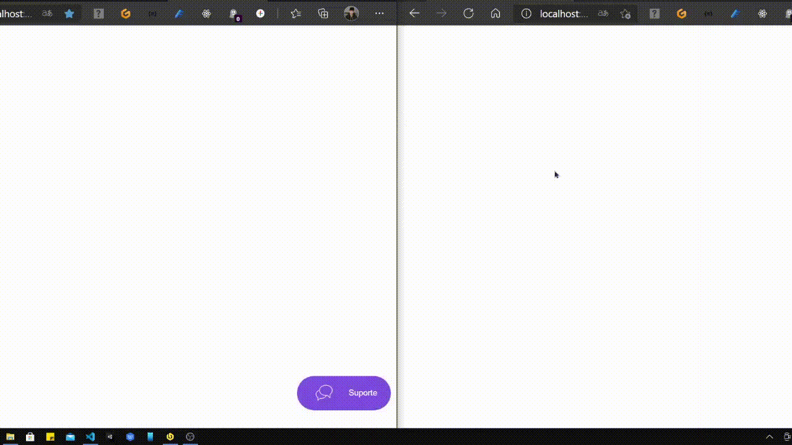

    <h1>Chat NLW</h1>
	

## :dart: Objetivo

Criar um chat para estabelecer a relação entre atendente e cliente em determinada empresa. Feito ao longo da next level week (NLW) 

## :hammer_and_wrench: Ferramentas

-   [Socket.io](https://socket.io/)
-   [Postgresql](https://www.postgresql.org/)
-   [Typeorm](https://typeorm.io/#/)
-   [Mustache](https://mustache.github.io/)

## Autor 

### 

### Matheus Santos

